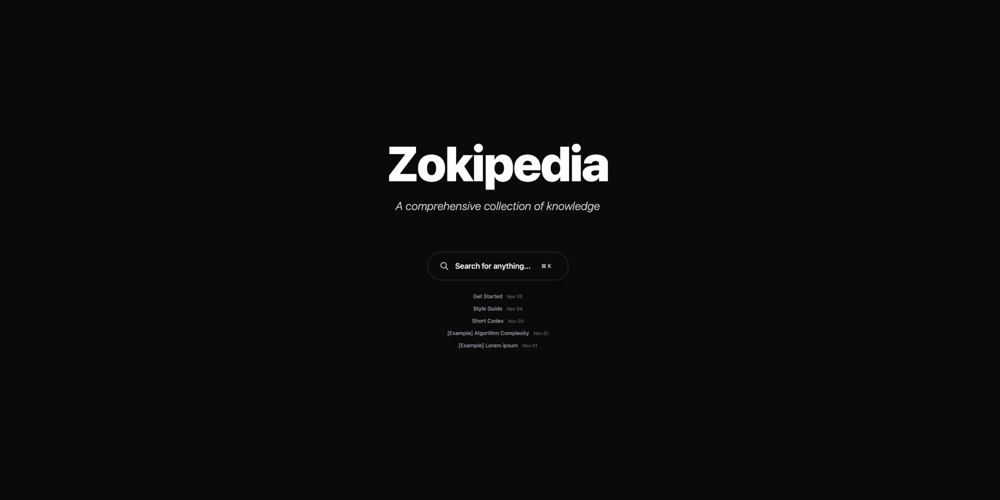

# Zokipedia

A minimal knowledge base theme for Zola, inspired by Grokipedia’s dark UI.

## Features
- Fast static site (Zola)
- Fuzzy search (Fuse.js) with Cmd/Ctrl + K
- Responsive, dark theme
- Auto-generated TOC with active highlighting

## Quick Start
1. Install Zola: https://www.getzola.org/documentation/getting-started/installation/
2. Run the dev server:

        zola serve

3. Open http://127.0.0.1:1111

## Create Content
Add a Markdown file under `content/`:

    +++
    title = "Your Article Title"
    date = 2024-01-15
    description = "Article description"
    tags = ["tag1", "tag2"]
    +++

    # Your Article Title

    Your content here...

## Shortcodes
- Math (KaTeX)

        
        E = mc^2
        

  Inline: `$x = \frac{-b \pm \sqrt{b^2 - 4ac}}{2a}$`

- Mermaid

        
        graph TD
            A[Start] --> B[Process]
            B --> C[End]
        

## Deploy
- Build: `zola build` (outputs `public/`)
- GitHub Pages: deploy `public/`
- Netlify: Build command `zola build`, publish `public`
